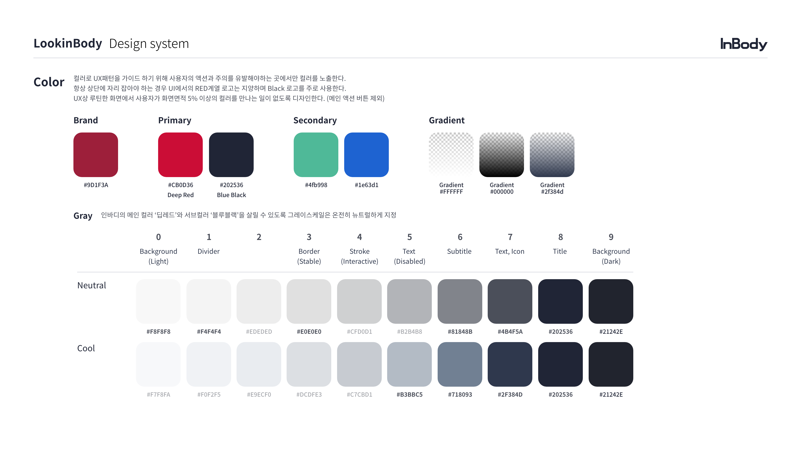
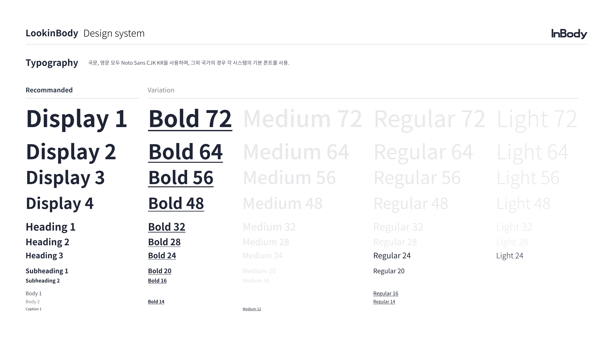
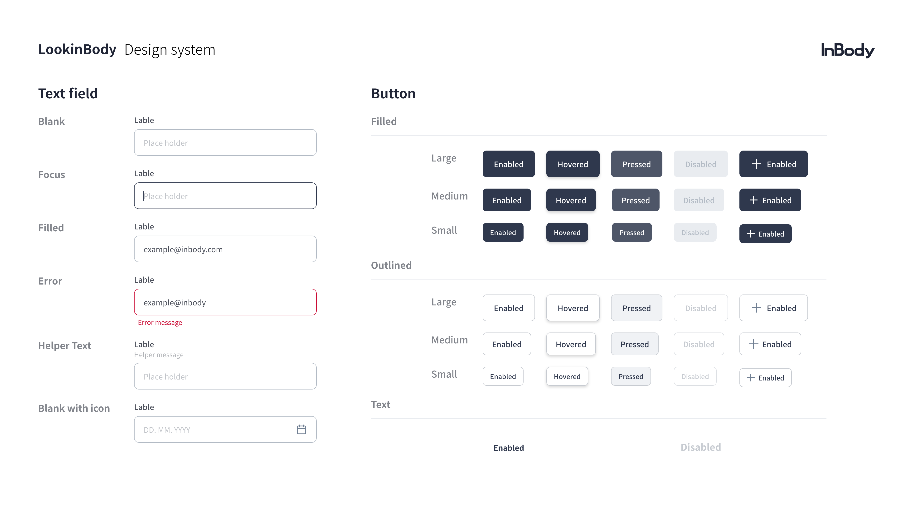
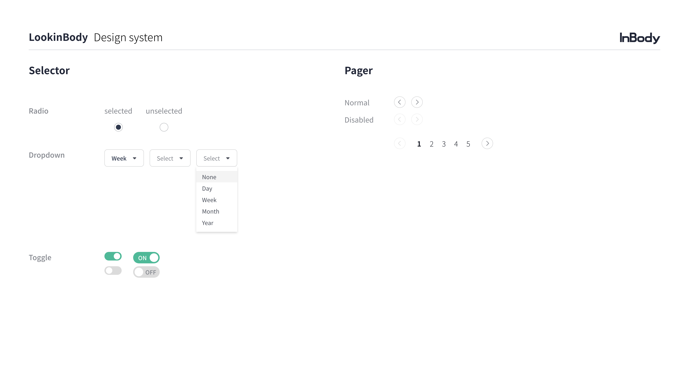

# Design System 
## - 목적 : 일관성있는 UI/UX와 디자인/개발 생산성 향상을 위해 구축.
### - 사용 방법 : 적용하고 싶은 디자인을 클래스로 가져와 사용.<br>
> ex) 아래와 같이 사용 시, '안녕하세요' 글씨가 NotoSans 글씨체, 64 크기, brand에 지정된 색상(빨강)으로 보이게 됨. 
> ```html
> <p class='ns-b64 fc-brand'>안녕하세요</p>`






```css
/***************************************************************************************/
/********************* reset css : v2.0 | Last_Update : 2021.11.11 *********************/
/***************************************************************************************/
/* 브라우저 기본 CSS를 초기화하기 위해 사용 */
*,
*::before,
*::after {
  margin: 0;
  padding: 0;
  box-sizing: border-box;
  -webkit-tap-highlight-color:transparent;
}
html, body, div, span, applet, object, iframe,
h1, h2, h3, h4, h5, h6, p, blockquote, pre,
a, abbr, acronym, address, big, cite, code,
del, dfn, em, img, ins, kbd, q, s, samp,
small, strike, strong, sub, sup, tt, var,
b, u, i, center,
dl, dt, dd, ol, ul, li,
fieldset, form, label, legend,
table, caption, tbody, tfoot, thead, tr, th, td,
article, aside, canvas, details, embed, 
figure, figcaption, footer, header, hgroup, 
menu, nav, output, ruby, section, summary,
time, mark, audio, video {
	margin: 0;
	padding: 0;
	border: 0;
	font-size: 100%;
	font: inherit;
	vertical-align: baseline;
}
/* HTML5 display-role reset for older browsers */
article, aside, details, figcaption, figure, 
footer, header, hgroup, menu, nav, section {
	display: block;
}
body {
	line-height: 1;
}
ol, ul {
	list-style: none;
}
blockquote, q {
	quotes: none;
}
blockquote:before, blockquote:after,
q:before, q:after {
	content: '';
	content: none;
}
table {
	border-collapse: collapse;
	border-spacing: 0;
}
/***********************************************************************************/
/****************************** font family: Noto Sans *****************************/
/***********************************************************************************/
/* 21.12.10 : gradient, input, button css구조화 */
/***********************************************************************************/
/* 폰트 사이즈 rem 사용을 위해 기본 사이즈를 10px로 고정한다 */
html{
  font-size: 10px;
}
/* font-family를 사용 */
@font-face {
  font-family: 'NS-regular';
  font-style: normal;
  font-display: fallback;
  src: url('./fonts/NotoSans/noto-sans-kr-v13-korean-regular.woff') format('woff2');
}
@font-face {
  font-family: 'NS-light';
  font-style: normal;
  font-display: fallback;
  src: url('./fonts/NotoSans/noto-sans-kr-v13-korean-300.woff2') format('woff2');
}
@font-face {
  font-family: 'NS-medium';
  font-style: normal;
  font-display: fallback;
  src: url('./fonts/NotoSans/noto-sans-kr-v13-korean-500.woff2') format('woff2');
}
@font-face {
  font-family: 'NS-bold';
  font-style: normal;
  font-display: fallback;
  src: url('./fonts/NotoSans/noto-sans-kr-v13-korean-700.woff2') format('woff2');
}
/***************************************************************************************/
/***************************** CSS Last_Update : 2021.12.20 ****************************/
/***************************************************************************************/
:root{   /*** root에는 각 속성값들을 '정의'만 한다 ***/
  /********** font size START **********/
  --font-size-72: 7.2rem;
  --font-size-64: 6.4rem;
  --font-size-56: 5.6rem;
  --font-size-48: 4.8rem;
  --font-size-40: 4.0rem;
  --font-size-32: 3.2rem;
  --font-size-30: 3.0rem;
  --font-size-28: 2.8rem;
  --font-size-24: 2.4rem;
  --font-size-22: 2.2rem;
  --font-size-20: 2.0rem;
  --font-size-16: 1.6rem;
  --font-size-14: 1.4rem;
  --font-size-12: 1.2rem;

  /********** font weight START **********/
  --font-weight-bold: bold;
  --font-weight-medium: 500;
  --font-weight-regular: 300;
  --font-weight-light: 100;
  
  /******************** color START ********************/
  /* Brand */
  --color-9d1f3a: #9d1f3a; /* inBody brand color */
  /* Primary */
  --color-cb0d36: #cb0d36; /* deep Red */
  --color-202536: #202536; /* Blue Black */
  /* Secondary */
  --color-4fb998: #4fb998; /* Green */
  --color-1e63d1: #1e63d1; /* Blue */
  --color-ffffff: #ffffff; /* White */
  /* Neutral Gray */
  --color-f8f8f8: #f8f8f8;
  --color-f4f4f4: #f4f4f4;
  --color-ededed: #ededed;
  --color-e0e0e0: #e0e0e0;
  --color-cfd0d1: #cfd0d1;
  --color-b2b4b8: #b2b4b8;
  --color-81848b: #81848b;
  --color-4b4f5a: #4b4f5a;
  --color-202536: #202536;
  --color-21242e: #21242e;
  /* Cool Gray */
  --color-f7f8fa: #f7f8fa;
  --color-f0f2f5: #f0f2f5;
  --color-e9ecf0: #e9ecf0;
  --color-dcdfe3: #dcdfe3;
  --color-c7cbd1: #c7cbd1;
  --color-b3bbc5: #b3bbc5;
  --color-718093: #718093;
  --color-2f384d: #2f384d;
  --color-202536: #202536;
  --color-21242e: #21242e;
}


/**************************************************************************************/
/****************************** 클래스용 Customize START *******************************/
/**************************************************************************************/
/* display 없애기 : 사용한 HTML태그 영역이 없어짐 */
.dn{
  display: none !important;
}
/* display 숨기기 : 사용한 HTML태그 영역은 그대로, 보이지만 않음 */
.vn{
  visibility: hidden !important;
}
/***************** 폰트 관련 START *****************/
/*************** Bold ***************/
.ns-b72{ /* ex) NotoSans-Bold-72 */
  font-size: var(--font-size-72);
  font-family: 'NS-bold';
}
.ns-b64{
  font-size: var(--font-size-64);
  font-family: 'NS-bold';
}
.ns-b56{
  font-size: var(--font-size-56);
  font-family: 'NS-bold';
}
.ns-b48{
  font-size: var(--font-size-48);
  font-family: 'NS-bold';
}
.ns-b40{
  font-size: var(--font-size-40);
  font-family: 'NS-bold';
}
.ns-b32{
  font-size: var(--font-size-32);
  font-family: 'NS-bold';
}
.ns-b30{
  font-size: var(--font-size-30);
  font-family: 'NS-bold';
}
.ns-b28{
  font-size: var(--font-size-28);
  font-family: 'NS-bold';
}
.ns-b24{
  font-size: var(--font-size-24);
  font-family: 'NS-bold';
}
.ns-b22{
  font-size: var(--font-size-22);
  font-family: 'NS-bold';
}
.ns-b20{
  font-size: var(--font-size-20);
  font-family: 'NS-bold';
}
.ns-b16{
  font-size: var(--font-size-16);
  font-family: 'NS-bold';
}
.ns-b14{
  font-size: var(--font-size-14);
  font-family: 'NS-bold';
}
.ns-b12{
  font-size: var(--font-size-12);
  font-family: 'NS-bold';
}
/*************** Medium ***************/
.ns-m72{
  font-size: var(--font-size-72);
  font-family: 'NS-medium';
}
.ns-m64{
  font-size: var(--font-size-64);
  font-family: 'NS-medium';
}
.ns-m56{
  font-size: var(--font-size-56);
  font-family: 'NS-medium';
}
.ns-m48{
  font-size: var(--font-size-48);
  font-family: 'NS-medium';
}
.ns-m40{
  font-size: var(--font-size-40);
  font-family: 'NS-medium';
}
.ns-m32{
  font-size: var(--font-size-32);
  font-family: 'NS-medium';
}
.ns-m30{
  font-size: var(--font-size-30);
  font-family: 'NS-medium';
}
.ns-m28{
  font-size: var(--font-size-28);
  font-family: 'NS-medium';
}
.ns-m24{
  font-size: var(--font-size-24);
  font-family: 'NS-medium';
}
.ns-m22{
  font-size: var(--font-size-22);
  font-family: 'NS-medium';
}
.ns-m20{
  font-size: var(--font-size-20);
  font-family: 'NS-medium';
}
.ns-m16{
  font-size: var(--font-size-16);
  font-family: 'NS-medium';
}
.ns-m14{
  font-size: var(--font-size-14);
  font-family: 'NS-medium';
}
.ns-m12{
  font-size: var(--font-size-12);
  font-family: 'NS-medium';
}
/************** Regular **************/
.ns-r72{
  font-size: var(--font-size-72);
  font-family: 'NS-regular';
}
.ns-r64{
  font-size: var(--font-size-64);
  font-family: 'NS-regular';
}
.ns-r56{
  font-size: var(--font-size-56);
  font-family: 'NS-regular';
}
.ns-r48{
  font-size: var(--font-size-48);
  font-family: 'NS-regular';
}
.ns-r40{
  font-size: var(--font-size-40);
  font-family: 'NS-regular';
}
.ns-r32{
  font-size: var(--font-size-32);
  font-family: 'NS-regular';
}
.ns-r30{
  font-size: var(--font-size-30);
  font-family: 'NS-regular';
}
.ns-r28{
  font-size: var(--font-size-28);
  font-family: 'NS-regular';
}
.ns-r24{
  font-size: var(--font-size-24);
  font-family: 'NS-regular';
}
.ns-r22{
  font-size: var(--font-size-22);
  font-family: 'NS-regular';
}
.ns-r20{
  font-size: var(--font-size-20);
  font-family: 'NS-regular';
}
.ns-r16{
  font-size: var(--font-size-16);
  font-family: 'NS-regular';
}
.ns-r14{
  font-size: var(--font-size-14);
  font-family: 'NS-regular';
}
.ns-r12{
  font-size: var(--font-size-12);
  font-family: 'NS-regular';
}
/*************** Light ***************/
.ns-l72{
  font-size: var(--font-size-72);
  font-family: 'NS-light';
}
.ns-l64{
  font-size: var(--font-size-64);
  font-family: 'NS-light';
}
.ns-l56{
  font-size: var(--font-size-56);
  font-family: 'NS-light';
}
.ns-l48{
  font-size: var(--font-size-48);
  font-family: 'NS-light';
}
.ns-l40{
  font-size: var(--font-size-40);
  font-family: 'NS-light';
}
.ns-l32{
  font-size: var(--font-size-32);
  font-family: 'NS-light';
}
.ns-l30{
  font-size: var(--font-size-30);
  font-family: 'NS-light';
}
.ns-l28{
  font-size: var(--font-size-28);
  font-family: 'NS-light';
}
.ns-l24{
  font-size: var(--font-size-24);
  font-family: 'NS-light';
}
.ns-l22{
  font-size: var(--font-size-22);
  font-family: 'NS-light';
}
.ns-l20{
  font-size: var(--font-size-20);
  font-family: 'NS-light';
}
.ns-l16{
  font-size: var(--font-size-16);
  font-family: 'NS-light';
}
.ns-l14{
  font-size: var(--font-size-14);
  font-family: 'NS-light';
}
.ns-l12{
  font-size: var(--font-size-12);
  font-family: 'NS-light';
}
/********** Font Color Brand **********/
.fc-brand{color:var(--color-9d1f3a);}
/* Font Color Primary */
.fc-pdr{color:var(--color-cb0d36);}
.fc-pbb{color:var(--color-202536);}
/* Font Color Secondary */
.fc-sg{color:var(--color-4fb998);}
.fc-sb{color:var(--color-1e63d1);}
.fc-ff{color:var(--color-ffffff);}
/* Font Color Neutral Gray */
.fc-ng0{color:var(--color-f8f8f8);}
.fc-ng1{color:var(--color-f4f4f4);}
.fc-ng2{color:var(--color-ededed);}
.fc-ng3{color:var(--color-e0e0e0);}
.fc-ng4{color:var(--color-cfd0d1);}
.fc-ng5{color:var(--color-b2b4b8);}
.fc-ng6{color:var(--color-81848b);}
.fc-ng7{color:var(--color-4b4f5a);}
.fc-ng8{color:var(--color-202536);}
.fc-ng9{color:var(--color-21242e);}
/* Font Color Cool Gray */
.fc-cg0{color:var(--color-f7f8fa);}
.fc-cg1{color:var(--color-f0f2f5);}
.fc-cg2{color:var(--color-e9ecf0);}
.fc-cg3{color:var(--color-dcdfe3);}
.fc-cg4{color:var(--color-c7cbd1);}
.fc-cg5{color:var(--color-b3bbc5);}
.fc-cg6{color:var(--color-718093);}
.fc-cg7{color:var(--color-2f384d);}
.fc-cg8{color:var(--color-202536);}
.fc-cg9{color:var(--color-21242e);}
/********** Background Color Brand **********/
.bc-brand{background-color:var(--color-9d1f3a);}
/* Background Color Primary */
.bc-pdr{background-color:var(--color-cb0d36);}
.bc-pbb{background-color:var(--color-202536);}
/* Background Color Secondary */
.bc-sg{background-color:var(--color-4fb998);}
.bc-sb{background-color:var(--color-1e63d1);}
.bc-ff{background-color:var(--color-ffffff);}
/* gradient */
.gr-t1{background-image: linear-gradient(to bottom, rgba(255, 255, 255, 0), #fff);}
.gr-t2{background-image: linear-gradient(to bottom, rgba(0, 0, 0, 0), #000);}
.gr-t3{background-image: linear-gradient(to bottom, rgba(47, 56, 77, 0), #2f384d);}
/* Background Color Neutral Gray */
.bc-ng0{background-color:var(--color-f8f8f8);}
.bc-ng1{background-color:var(--color-f4f4f4);}
.bc-ng2{background-color:var(--color-ededed);}
.bc-ng3{background-color:var(--color-e0e0e0);}
.bc-ng4{background-color:var(--color-cfd0d1);}
.bc-ng5{background-color:var(--color-b2b4b8);}
.bc-ng6{background-color:var(--color-81848b);}
.bc-ng7{background-color:var(--color-4b4f5a);}
.bc-ng8{background-color:var(--color-202536);}
.bc-ng9{background-color:var(--color-21242e);}
/* Background Color Cool Gray */
.bc-cg0{background-color:var(--color-f7f8fa);}
.bc-cg1{background-color:var(--color-f0f2f5);}
.bc-cg2{background-color:var(--color-e9ecf0);}
.bc-cg3{background-color:var(--color-dcdfe3);}
.bc-cg4{background-color:var(--color-c7cbd1);}
.bc-cg5{background-color:var(--color-b3bbc5);}
.bc-cg6{background-color:var(--color-718093);}
.bc-cg7{background-color:var(--color-2f384d);}
.bc-cg8{background-color:var(--color-202536);}
.bc-cg9{background-color:var(--color-21242e);}


/******************** 버튼 공통 ********************/
.LB_Btn{
  line-height: 1.5;
  border-radius: 8px;
  border: none;
  font-size: 1.6rem;
  font-family: 'medium';
  display: flex;
  justify-content: center;
  align-items: center;
  cursor: pointer;
}
.LB_Btn:hover{
  box-shadow: 0 3px 6px 0 rgba(0, 0, 0, 0.16);
}
/******************** btn-[크기]-[색상] ********************/
/* [크기] L: Large, M: Medium, S: Small, */
/* [색상] B: Black, W: White, */
/* Filled 버튼 클래스 : 배경 색상 있음*/
.btn-L-B{
  padding: 16px 24px;
  min-width: 110px;
  min-height: 56px;
  background-color: #2f384d;
  color: #fff;
}
.btn-M-B{
  padding: 12px 20px;
  min-width: 100px;
  min-height: 48px;
  background-color: #2f384d;
  color: #fff;
}
.btn-S-B{
  padding: 10px 16px;
  min-width: 86px;
  min-height: 40px;
  background-color: #2f384d;
  color: #fff;
}
.btn-L-B:active,
.btn-M-B:active,
.btn-S-B:active{
  background-color: #4e5668;
}
.btn-L-B.disabled,
.btn-M-B.disabled,
.btn-S-B.disabled{
  pointer-events: none;
  background-color: #e9ecf0;
  color: #b3bbc5;
}

/* Outlined 버튼 클래스 : 배경 색상 없음*/
.btn-L-W{
  padding: 16px 24px;
  min-width: 110px;
  min-height: 56px;
  background-color: #fff;
  color: #2f384d;
  border: solid 1px #c7cbd1;
}
.btn-M-W{
  padding: 12px 20px;
  min-width: 100px;
  min-height: 48px;
  background-color: #fff;
  color: #2f384d;
  border: solid 1px #c7cbd1;
}
.btn-S-W{
  padding: 10px 16px;
  min-width: 86px;
  min-height: 40px;
  background-color: #fff;
  color: #2f384d;
  border: solid 1px #c7cbd1;
}
.btn-L-W:active,
.btn-M-W:active,
.btn-S-W:active{
  background-color: #f0f2f5;
}
.btn-L-W.disabled,
.btn-M-W.disabled,
.btn-S-W.disabled{
  pointer-events: none;
  background-color: #fff;
  color: #c7cbd1;
}

/* Text 버튼 클래스 : 버튼 테두리 없음*/
.btn-Text{
  padding: 16px 23px;
  min-width: 110px;
  min-height: 56px;
  background-color: #fff;
  color: #2f384d;
  border: none;
  font-family: 'bold';
}
.btn-Text:hover{
  box-shadow: none;
}
.btn-Text.disabled{
  pointer-events: none;
  color: #c7cbd1;
}

/* Input : Text Field */
.LB_InputWrapper{
  font-size: 1.4rem;
  color: #4b4f5a;
}
.LB_InputWrapper .helperMSG,
.LB_InputWrapper .errorMSG{
  display: none;
}
.LB_InputWrapper.helper .helperMSG{
  display: block;
  color: #b2b4b8;
  margin-top: 8px;
}
.LB_InputWrapper.error .errorMSG{
  display: block;
  color: #cb0d36;
  padding: 8px 0 0 8px;
}
.LB_InputWrapper.error input{
  border: 1px solid #cb0d36;
}
.LB_InputWrapper input:focus{
  border: 1px solid #2f384d;
}
.LB_InputWrapper input{
  height: 56px;
  font-size: 1.6rem;
  outline: none;
  border: 1px solid #b3bbc5;
  border-radius: 10px;
  width: 380px;
  padding: 0 20px;
  color: #4b4f5a;
  margin-top: 8px;
}
.LB_InputWrapper input::placeholder{
  color: #c1c4c9;
}

/* Select Box 관련*/
.LB_SelectBox{
  height: 48px;
  min-width: 110px;
  width: fit-content;
  border-radius: 8px;
  border: solid 1px #cfd0d1;
  cursor: pointer;
  position: relative;
  background-color: #fff;
  display: flex;
  align-items: center;
  justify-content: center;
}
.LB_SelectBox .boxWrapper{
  display: flex;
  align-items: center;
  justify-content: space-between;
  pointer-events: none;
  width: 100%;
  height: 100%;
  padding: 0 20px;
}
.LB_SelectBox .boxWrapper .dropDownBtnImg{
  margin-left: 12px;
  transform: translateY(1px);
}
.LB_SelectBox .dropDownListWrapper::-webkit-scrollbar{
  display:none;
}
.LB_SelectBox .dropDownListWrapper{
  position: absolute;
  box-shadow: 0 3px 6px 0 rgba(0, 0, 0, 0.16);
  background-color: #fff;
  transform: translateY(120px);
  min-width: 110px;
  padding: 10px 0;
  display: none;
  overflow: auto;
  max-height: 190px;
}
.LB_SelectBox.active .dropDownListWrapper{
  display: block;
}
.LB_SelectBox .dropDownListWrapper .dropDownList{
  height: 34px;
  display: flex;
  align-items: center;
  padding: 0px 15px;
}
.LB_SelectBox .dropDownListWrapper .dropDownList:hover{
  background-color: #f4f4f4;
}


/**************************************************************************************/
/******************************* 클래스용 Customize END ********************************/
/**************************************************************************************/

